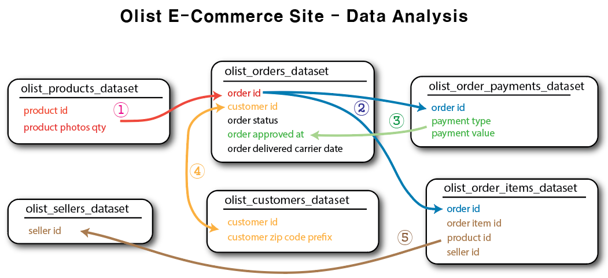

# Olist 데이터 분석
하루키팀 
# 주제

브라질 Olist 이커머스 데이터 분석  [[데이터셋 링크]](https://www.kaggle.com/datasets/olistbr/brazilian-ecommerce)

# 상황 인식

Olist는 온라인 백화점이라 불리는 서비스입니다. 셀러들이 Olist에 상품정보를 등록하면 Olist는 그 상품정보를 여러 온라인 마켓사이트에 등록해주고 주문관리를 간편하게 만들어줍니다. 온라인 마켓사이트에서 주문이 들어오면 즉시 셀러에게 알려주고 물류도 처리해줍니다.

Olist 데이터셋은 2016년 10월부터 2년간의 주문, 상품, 고객, 셀러에 대한 기록입니다. 자세한 상품명과 회사명은 비식별화 처리되었습니다.

# 문제 정의

1. 최대한 많이 시각화한다.
2. Olist에 입점하려는 셀러에게 유용한 정보를 도출한다.

# EDA

### Olist Data Relationship


### 전처리

- 결측치 필터링

`T10_dataframe.isnull().sum()`

```python
order_id                    0
product_id                  0
order_item_id               0
product_category_name    1603
dtype: int64
```

결측치 1603개 발견 → `TO10_dataframe = T10_dataframe.dropna(axis = 0)`

- 포르투갈어 → 영어로 변경
- merge 작업
  
    
    

### 판매량 Top 10 카테고리


#  지도 시각화 
지역별 평균 소비금액,  상품 배송일과 상품의 리뷰 평점 사이의 관계를 시각화하였습니다.
- 지역별 총 소비 금액(수익)
    
    
    지역별 총 구매 금액
    상파울루(SP)는 총 구매금액이 많지만 고객이 주문당 가격을 적게 지불합니다.
    
    

- 지역별 1인당 평균 구매가격
    
    브라질 남부 및 남동부 지역의 고객들은 북부 및 북동부 지역의 다른 고객들보다 평균 구매가격이 더 낮다.
    
    
    
    지역별로 평균 가격대
    
    

- 지역별 평균 배송비와 운송 비율
    
    지역별 평균 배송비
    
    
    
    지역별 총 배송비
    
    
    
    배송비를 주문비로 나누면 `운송 비율`을 찾을 수 있습니다. 
    이 비율은 주문품을 배달하기 위해 사람이 지불해야 했던 제품 가격의 백분율  
    예를 들어, 제품의 가격이 50.00이고 배송비가 10.00인 경우 운송 비율은 0.2 또는 20%입니다.  
    높은 운임 비율은 고객들이 구매를 완료하지 못하게 할 가능성이 매우 높습니다.
    물류 비용 때문에 인구 밀도가 높은 지역에서는 낮은 운임 비율이, 희박한 지역에서는 높은 운임 비율이 예상됩니다.
    
    


- 지역별 평균 배송일
    
    
    
- 지역별 평균 리뷰 스코어
    
    

- 지역별 지연 비율   
- 
    

- 리우의 평균 배송일과 리뷰 스코어, 지연 비율
       

    
    

    

    지도 상에서 평균 배송일과 리뷰 평점이 관계가 있어보여서 상관관계 계수를 계산했습니다. 두 피처 사이에 상관관계가 상당히 있어 인과관계를 분석할 필요가 있어보입니다.
    
    

- 총 정리
    
    평균 배송비   
    
    평균 배송일   
    
    평균 배송 예측일과 배송일의 차이   
      
    
    

---

<aside>
 시간에 따른 구매   

</aside>

1. 브라질 전자상거래의 성장 추세가 있는지?
2. 브라질 고객들은 어떤 요일에 온라인 구매를 하는지?
3. 브라질 고객은 보통 몇 시(새벽, 아침, 오후 또는 밤)에 구매하는지?
    
    


위의 도표를 통해 다음과 같은 결론을 내릴 수 있습니다.

- 브라질에서의 전자상거래는 시간이 지남에 따라 정말로 증가하는 추세를 가지고 있다. 특정 월에 피크가 나타나는 계절성을 볼 수 있지만 일반적으로 고객이 이전보다 온라인으로 물건을 구매하는 경향이 더 높다는 것을 알 수 있다.
- 월요일은 브라질 고객들이 선호하는 날이고 그들은 오후에 더 많이 사는 경향이 있다.

## 매출 대부분을 발생시킨 소비자와 판매자

- 총 소비금액 기준으로 상위 몇 퍼센트의 소비자가 대부분의 소비를 했는지?
    - 일회성 소비자가 많은 현상과 상관있을 것 (충성소비자가 적음)


- 총 판매금액 기준 상위 몇 퍼센트의 소비자가 대부분의 매출을 올렸는지?
    - 파레토 법칙을 거의 따르고 있음


## 고객 RFM 분석

### **Recency :** 고객이 얼마나 최근에 구매했는가?

- (데이터셋의 마지막 날짜) - (고객의 마지막 구매일)
- 현상
    - 2016년 11월, 12월은 판매 기록이 없다.
    - 1년 이내에 구매 이력이 있는 고객이 많다.


### **Frequency** : 각 고객이 구매한 횟수

- 고객당 주문수(order_id)를 세어서 측정
- 1회 구매한 고객이 약 97%


### Monetary : 고객별 총 구매금액

- 박스플롯
    - 작은 금액에 몰려있음
    - 4만 헤알(R$), 11만 헤알(R$)을 소비한 아웃라이어가 존재.

        

- 히스토그램
    - x축에 밑이 10인 log를 씌워서 히스토그램 확인
    - 평균가격대 (110~192 R$) 주변 가격이 많음
    - 각 주별로 평균 가격대
        

        


- RFM score
    - ( Recency + Frequency + 2 * Monetary ) /  4 로 계산


- RFM 점수 3D 시각화
    - 앞에서 그린 3개 그래프를
    - 대부분 한번 구매하고, 1000헤알 이하 금액대로 구매


- 소비자 Class별 R점수와 M점수
    - Class는 RFM 점수를 기준으로 4분할
    - R 점수, M 점수는 Recency, Monetary를 100점으로 환산


# 시간에 따른 판매 추세

판매량이 Top3 인 카테고리를 골라서 월별 판매량을 시각화했습니다.

### 침실&욕실물품

- 2018년부터는 안정적으로 600건 이상 판매
- 11월은 블랙프라이데이 영향으로 구매량이 대폭 증가


- 헬스&뷰티
    - 꾸준히 증가하는 추세를 보입니다.


### 스포츠&레저

- 6월에 매출이 떨어진 이유를 겨울이여서로 볼 수 있다.


# 결론

- 다양한 측면에서 시각화를 진행하였습니다.
- 대부분의 소비가 100~1000 헤알(R$) 금액대에서 일어났습니다.
- 반복 구매자 비율은 약 2%로 매우 작았습니다.
- 배송일이 늦을수록 리뷰 평점이 낮은 경향이 있었습니다.
- 셀러에게 조언
    - 100 R$ 위주의 카테고리(제품)을 선택하라.
    - 일회성 구매자를 노려라.

## 회고록

### 근혜 회고

평면적인 데이터가 아니라 다른 데이터셋들간에 연결관계가 있는 데이터를 다루는 경험을 해보아 좋았다. 데이터베이스를 공부하고나서 다시 이런 복잡한 데이터에 도전하고싶다. 

Frequency 분석에서 2회, 3회 이상 구매한 사람들과 그 상품의 판매자는 어떤 특징을 갖고있는지 궁금하다. 

주어진 데이터 내에서 대부분의 분석을 했는데, 시간적 공간적으로 브라질에 대한 배경지식을 더 갖추고 했으면 좋았을것같다.

### 수진 회고

배운 점 : geolocation 데이터를 이용해서 지도에 배송 소요일과 리뷰 평점을 시각화하는 법을 배웠다. 
시간에 따른 구매를 보고 브라질 고객이 어떤 요일에 많이 구매하는지와 몇 시에 구매하는 지를 알 수 있었다.

아쉬운 점 : 각 카테고리 별로 배송 소요일과 리뷰 평점을 해보고 싶었고, 1개의 State에서 배송 소요일이 긴 카테고리 제품과 짧은 카테고리 제품을 선별해 보고 싶었지만, 시간이 부족해서 하지 못해서 아쉽다.

느낀 점 :  하나의 타겟 예를 들어 1개의 state 또는 1개의 카테고리를 기준으로 EDA를 세밀하게 해보는 것이 좋았을 것 같다.